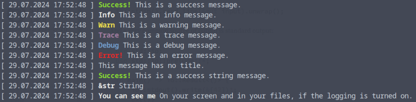

# Print and log
A simple crate for your CLI application that lets you print formatted messages to the console and/or write them in a log file.

Sometimes the tools of the std::io or println! macros are just not enough to give you instantly recognizable output. And sometimes even showing messages is not enough for you, you want to write them somewhere.

## Initialize your instance at the beginning.
~~~
use print_and_log::*;

let mut pal = PrintAndLog::new();
~~~

If you don’t want to change the settings, it doesn’t have to be mutable. If you do though, you can do it by calling some wrapper functions. Logging is enabled by default. You can turn it off, if you want to override the behavior of the print_and_log function after you implement it. The formatting options can be found 
[here](https://docs.rs/chrono/latest/chrono/format/strftime/index.html).

~~~
pal.set_log_to_file(true);
let _we_are_writing_logs: bool = pal.get_log_to_file();

let _ = pal.set_log_file_name("mycool.log");
let _name_of_the_log_file: String = pal.get_log_file_name();

let _ = pal.set_max_file_size(4000000);
let _maximal_log_file_size: u32 = pal.get_max_file_size();

let _ = pal.set_timestamp_format_for_print("%d %m");
let _timestamp_format: String = pal.get_timestamp_format_for_print();
~~~
The usage is pretty straight forward. The functions accept &str and String. First argument is the title of the message that appears bold and in color, then the longer message itself, then what kind of message you want it to be:
~~~
pal.print("Success!", "This is a success message.", &PALMessageType::Success);
pal.print("Info", "This is an info message.", &PALMessageType::Info);
pal.print("Warn", "This is a warning message.", &PALMessageType::Warn);
pal.print("Trace", "This is a trace message.", &PALMessageType::Trace);
pal.print("Debug", "This is a debug message.", &PALMessageType::Debug);
pal.print("Error!", "This is an error message.", &PALMessageType::Error);
pal.print("", "This message has no title.", &PALMessageType::Info);
~~~
Using String:
~~~
pal.print(String::from("Success!"), String::from("This is a success string message."), &PALMessageType::Success);
~~~
Using both:
~~~
pal.print("&str", String::from("String"),&PALMessageType::Info);
~~~
If you wish, you can log message using the same principle:
~~~
pal.log("Test", "It's a message!", &PALMessageType::Info);
~~~
Or why not both? Show it to your user and store it for them to admire for later:
~~~
pal.print_and_log("You can see me","On your screen and in your files, if the logging is turned on.",&PALMessageType::Info);
~~~

## Credits
This crate uses [chrono](https://crates.io/crates/chrono) for getting the timestamps and [colored](https://crates.io/crates/colored) for formatting the output.